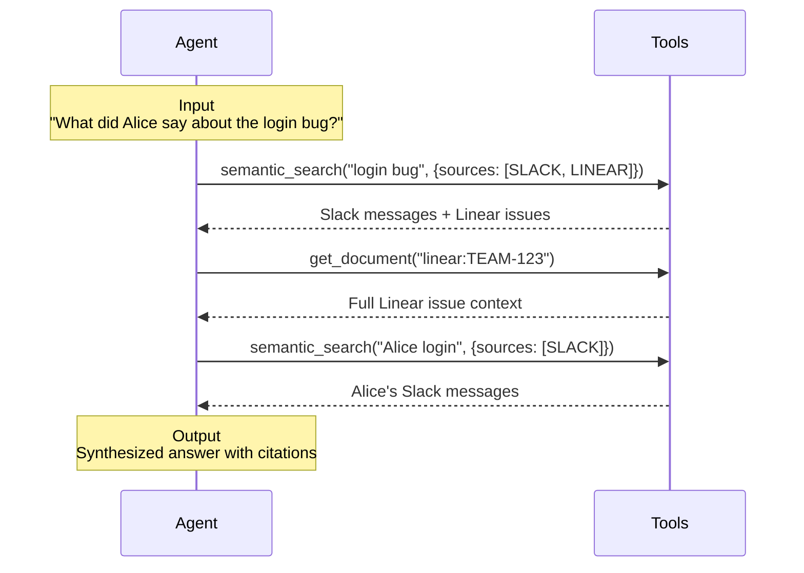

Grapevine is a **real-time unified knowledge store** that connects to your company's data sources and gives agents the ability to search through them. We designed Grapevine to work well with reasoning models, and designed our [MCP's tools](/features/mcp-api) after the tools that Claude Code uses to navigate a codebase.

# How it works

1. **Connect** - Integrate your data sources through secure OAuth connections and API keys
2. **Ingest** - Using a combination of real-time webhook processing, backfills, and periodic API syncs, Grapevine continuously ingests your data
3. **Process** - Grapevine processes all your data in context, structuring it to give agents a rich understanding of how _your_ company works.
4. **Search** - Give an agent access to our [search tools](/features/mcp-api#search-tools), or use [our built-in agent](/features/mcp-api#agent-tools) to answer natural language queries.

### What does Grapevine ingest?

Grapevine is intended to ingest data from all the platforms where your work is done. Currently, this includes:

- **Communication platforms** - [Slack](/connectors/slack), [GMail](/connectors/google-email), [Gather](/connectors/gather), [Gong](/connectors/gong)
- **Documentation** - [Notion](/connectors/notion), [Confluence](/connectors/confluence), [Google Drive](/connectors/google-drive)
- **Code repositories** - [GitHub](/connectors/github)
- **Project management** - [Linear](/connectors/linear), [Jira](/connectors/jira)
- **CRMs** - [HubSpot](/connectors/hubspot), [Salesforce](/connectors/salesforce)

Check out the [Reference](/features/api-reference) page for a full list, and more details on each connector.

### Example Search Loop

# How do I try Grapevine?

### Self-hosting
We are working on making Grapevine **self-hostable**, so you can run it on your own infrastructure. If you are interested in trying out this experience, contact us.

### Using our hosted MCP server

The quickest way to get started is by using our hosted MCP server at `https://mcp.getgrapevine.ai`. For more information, check out our [Quickstart guide](/index).