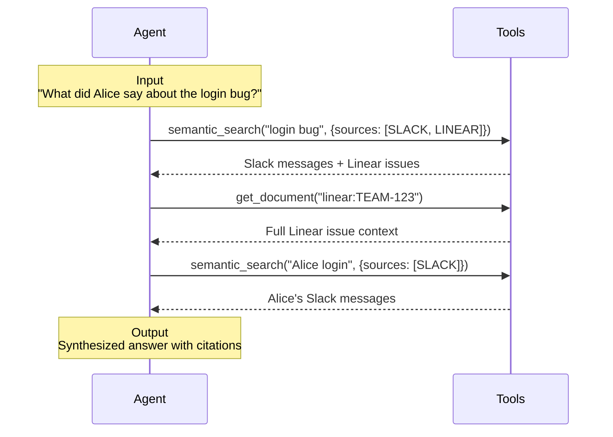

Grapevine ingests updates from all of your work platforms (Slack, docs, meetings, etc.), and continuously re-structures them to be performant with work-AI Agents.

# How it works

1. **Connect** - Integrates with your data sources through secure OAuth connections and API keys
2. **Ingest** - Continuously ingests your data with real-time webhook processing, backfills, and periodic API syncs
3. **Process** - Indexes your data with heuristics like recency, relevance, and semantic understanding. When helpful, Grapevine will create new artifacts to cut out human noise
4. **Search** - Exposes the [search tools](/features/mcp-api#search-tools) for your agent to use

### What does Grapevine ingest?

Grapevine is intended to ingest data from all the platforms where your work is done. Currently, this includes:

- **Communication platforms** - [Slack](/connectors/slack), [Gmail](/connectors/google-email), [Gather](/connectors/gather), [Gong](/connectors/gong)
- **Documentation** - [Notion](/connectors/notion), [Confluence](/connectors/confluence), [Google Drive](/connectors/google-drive)
- **Code repositories** - [GitHub](/connectors/github)
- **Project management** - [Linear](/connectors/linear), [Jira](/connectors/jira)
- **CRMs** - [HubSpot](/connectors/hubspot), [Salesforce](/connectors/salesforce)

Check out the [Reference](/features/api-reference) page for a full list, and more details on each connector.

### Example Search Loop

# How do I try Grapevine?

### Self-hosting
We are working on making Grapevine **self-hostable**, so you can run it on your own infrastructure. If you are interested in trying out this experience, contact us.

### Using our hosted MCP server

The quickest way to get started is by using our hosted MCP server at `https://mcp.getgrapevine.ai`. For more information, check out our [Quickstart guide](/index).